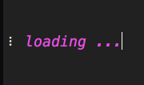

# load
> CLI progress indicator for PHP.



## Install

```bash
$ composer require troublete/load
```

## Usage

```php
<?php
require_once 'path/to/vendor/autoload.php';

use function Load\dots;

$current = 0;
dots(function () use (&$current) {			
	$current++;
	if ($current == 100) {
		return true;
	}
	return "$current%";
}, '✔ done.');
```

## API

## Functions

### dots($checkClosure, $doneText)

Will run an indicator with dots.

#### Arguments 

> ℹ️ see function `loop()`

### spinner($checkClosure, $doneText)

Will run an indicator with an rotating bar.

#### Arguments 

> ℹ️ see function `loop()`

### loop($frames, $checkClosure, $doneText)

Will run an indicator with frames given.

#### Arguments

| Argument | Type | Description |
|---|---|---|
| $frames | `array` | Loopable frames of the loading animation in the best case all with same character length so the animation seems fluid. |
| $checkClosure | `callable` | A callable structure, that will get called in any tick of the loading spinner (frame call) to check if loading is done. If the function returns a `string` or `numeric` value, the value will get passed as text output to the right side of the loading indicator. If the return value is `true` the `doneText` will be rendered instead of the loading indicator (plus any message beside it). If the return value is `false` an fatal error will be triggered. |
| $doneText | `string` | A text that will be displayed if the `$checkClosure` returned true. |

## Related Packages

* [Cli](https://github.com/troublete/cli) - It's like meow, but for PHP.
* [Crayon](https://github.com/troublete/crayon) - A simple functional PHP library for formatting string output 

## License

GPL-2.0 © Willi Eßer